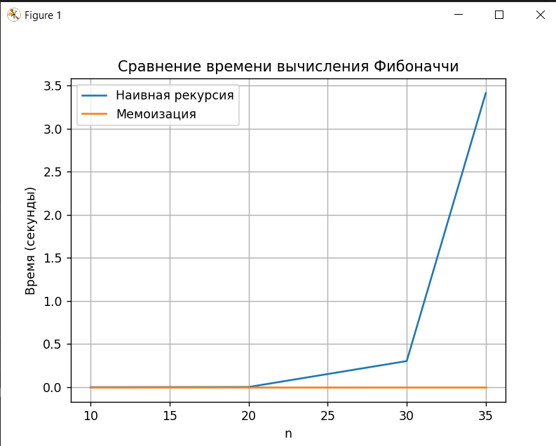

Отчет по лабораторной работе 3
Рекурсия

**Дата:** [2025-10-20]
**Семестр:** [5 семестр]
**Группа:** [ПИЖ-б-о-23-2]
**Дисциплина:** [Анализ сложности алгоритмов]
**Студент:** [Хаджимухаметов Саид]

## Цель работы
Освоить принцип рекурсии, научиться анализировать рекурсивные алгоритмы и
понимать механизм работы стека вызовов. Изучить типичные задачи, решаемые рекурсивно, и освоить
технику мемоизации для оптимизации рекурсивных алгоритмов. Получить практические навыки
реализации и отладки рекурсивных функций.

## Теоретическая часть
Рекурсия: Процесс, при котором функция прямо или косвенно вызывает саму себя для решения
задачи.
Базовый случай (условие выхода): Обязательное условие, которое прекращает рекурсивные
вызовы и предотвращает зацикливание.
Рекурсивный шаг: Шаг, на котором задача разбивается на более простую подзадачу того же
типа и производится рекурсивный вызов.
Глубина рекурсии: Количество вложенных вызовов функции. Ограничена размером стека
вызовов.
Стек вызовов (Call Stack): Структура данных, которая хранит информацию о незавершенных
вызовах функций (локальные переменные, адрес возврата).
Мемоизация (Memoization): Техника оптимизации, позволяющая избежать повторных
вычислений результатов функций для одних и тех же входных данных путем сохранения ранее
вычисленных результатов в кеше (например, в словаре).

## Практическая часть
### Выполненные задачи
- Создание проекта: Создать файлы recursion.py, memoization.py, recursion_tasks.py
- Реализация рекурсивных алгоритмов (в recursion.py) 
- Оптимизация с помощью мемоизации (в memoization.py)
- Решение практических задач (в recursion_tasks.py):

### Ключевые фрагменты кода
~~~python
[Пример кода]

memo = {}

def fibonacci_memo(n):
    if n in memo:
        return memo[n]
    if n == 0:
        memo[n] = 0
    elif n == 1:
        memo[n] = 1
    else:
        memo[n] = fibonacci_memo(n - 1) + fibonacci_memo(n - 2)
    return memo[n]

~~~
### Тестирование
Модульные тесты пройдены
Интеграционные тесты пройдены
Производительность соответствует требованиям

### Ответы на контрольные вопросы
1. Что такое базовый случай и рекурсивный шаг в рекурсивной функции? Почему отсутствие базового случая приводит к ошибке?
Базовый случай — условие остановки рекурсии. Это тот момент, когда функция перестает вызывать саму себя и возвращает конкретный результат.
Рекурсивный шаг — часть функции, в которой она вызывает саму себя с более простым или меньшим аргументом.
Если базового случая нет или он недостижим, рекурсивные вызовы никогда не закончатся, что приведёт к переполнению стека вызовов
2. Мемоизация — это техника оптимизации рекурсивных функций, при которой результаты вычислений сохраняются в словаре (кэше), чтобы не вычислять их повторно.
Для чисел Фибоначчи:
Наивная рекурсия пересчитывает одни и те же значения много раз → сложность O(2ⁿ).
Мемоизация сохраняет уже вычисленные значения и использует их повторно → сложность O(n).
Память также увеличивается до O(n) за счёт словаря. 
3. В чем заключается основная проблема глубокой рекурсии и как она связана со стеком вызовов?
Каждый рекурсивный вызов помещается в стек вызовов — специальную область памяти, где хранятся незавершённые функции. При глубокой рекурсии стек может переполниться, так как у него ограниченный размер. Это вызывает ошибку: RecursionError: maximum recursion depth exceeded
4. Задача о Ханойских башнях решается рекурсивно. Опишите алгоритм решения для 3 дисков.
У нас три стержня: A (начальный), B (вспомогательный) и C (целевой).

Алгоритм:
Переместить 2 верхних диска с A на B, используя C как вспомогательный.
Переместить самый большой диск (диск 3) с A на C.
Переместить 2 диска с B на C, используя A как вспомогательный.
Пошагово для 3 дисков:
A → C (диск 1)
A → B (диск 2)
C → B (диск 1)
A → C (диск 3)
B → A (диск 1)
B → C (диск 2)
A → C (диск 1)
5. Рекурсивный и итеративный алгоритмы могут решать одни и те же задачи. Назовите преимущества и недостатки каждого подхода.
Рекурсия - Достоинства: Код простой и понятный, естественно описывает задачи с повторяющейся структурой (деревья, графы, Ханойские башни)
Рекурсия - Недостатки: Переполнение стека, высокая накладная стоимость вызовов функций, иногда низкая производительность
Итеративный - Достоинства: Быстрее, экономит память, нет риска переполнения стека
Итеративный - Недостатки: Иногда код сложнее и менее читаемый

## Выводы
По итоговому выводу алгоритмов было выяснено, что мемозированная рекурсия выполняется гораздо быстрее обычной.

## Характеристики ПК
- Процессор: Intel 13400f
- Оперативная память: 16GB DDR4
