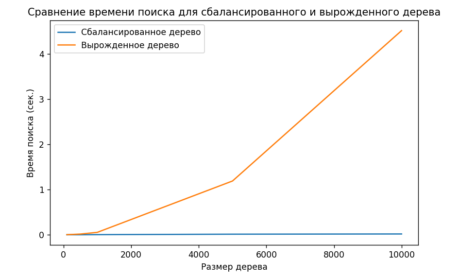

# Отчет по лабораторной работе 6
## Бинарное дерево поиска (Binary Search Tree)

**Дата:** 30.11.2025
**Семестр:** 5 семестр
**Группа:** ПИЖ-б-о-23-2
**Дисциплина:** Анализ сложности алгоритмов
**Студент:** Хаджимухаметов Саид Керимович

## Цель работы
Изучить древовидные структуры данных, их свойства и применение. Освоить основные
операции с бинарными деревьями поиска (BST). Получить практические навыки реализации BST на
основе узлов (pointer-based), рекурсивных алгоритмов обхода и анализа их эффективности.
Исследовать влияние сбалансированности дерева на производительность операций.

## Теоретическая часть

Дерево: Рекурсивная структура данных, состоящая из узлов, где каждый узел имеет значение и
ссылки на дочерние узлы.
Бинарное дерево поиска (BST): Дерево, для которого выполняются следующие условия:
Значение в левом поддереве любого узла меньше значения в самом узле.
Значение в правом поддереве любого узла больше значения в самом узле.
Оба поддерева являются бинарными деревьями поиска.
Основные операции BST:
Вставка (Insert): Сложность: в среднем O(log n), в худшем (вырожденное дерево) O(n).
Поиск (Search): Сложность: в среднем O(log n), в худшем O(n).
Удаление (Delete): Сложность: в среднем O(log n), в худшем O(n). Имеет три случая:
удаление листа, узла с одним потомком, узла с двумя потомками.
Обход (Traversal):
In-order (левый-корень-правый): Посещает узлы в порядке возрастания.
Сложность O(n).
Pre-order (корень-левый-правый): Полезен для копирования структуры дерева.
Сложность O(n).
Post-order (левый-правый-корень): Полезен для удаления дерева. Сложность O(n).
Сбалансированные деревья: Деревья с контролем высоты (например, AVL, Красно-черные),
которые гарантируют время операций O(log n) даже в худшем случае.

## Практическая часть

### Выполненные задачи

#### 1. Реализация структуры данных (binary_search_tree.py)
Успешно реализовано полнофункциональное бинарное дерево поиска с основными операциями:

**Класс TreeNode**
- Атрибуты: value (значение узла), left (левый потомок), right (правый потомок)
- Сложность создания: O(1)

**Класс BinarySearchTree**

- **insert(value)** - O(log n) в среднем, O(n) в худшем случае
  - Вставляет новый элемент в дерево, сохраняя свойство BST
  - Реализована итеративно для избежания переполнения стека

- **search(value)** - O(log n) в среднем, O(n) в худшем случае
  - Ищет элемент в дереве итеративным методом
  - Возвращает узел с найденным значением или None

- **delete(value)** - O(log n) в среднем, O(n) в худшем случае
  - Удаляет элемент из дерева, обрабатывая все три случая
  - Использует _find_min для поиска in-order successor при удалении узла с двумя потомками

- **is_valid_bst()** - O(n)
  - Проверяет, является ли дерево корректным BST
  - Использует рекурсивный подход с отслеживанием диапазона допустимых значений

- **height(node)** - O(n)
  - Вычисляет высоту дерева (количество уровней)
  - Рекурсивно вычисляет высоты левого и правого поддеревьев

#### 2. Реализация обходов дерева (tree_traversal.py)

**In-Order обход (рекурсивный)** - O(n)
```python
def in_order(node):  # O(n)
    if node:  # O(1)
        in_order(node.left)  # O(n) для левого поддерева
        print(node.value, end=" ")  # O(1)
        in_order(node.right)  # O(n) для правого поддерева
```

**Pre-Order обход (рекурсивный)** - O(n)
```python
def pre_order(node):  # O(n)
    if node:  # O(1)
        print(node.value, end=" ")  # O(1)
        pre_order(node.left)  # O(n)
        pre_order(node.right)  # O(n)
```

**Post-Order обход (рекурсивный)** - O(n)
```python
def post_order(node):  # O(n)
    if node:  # O(1)
        post_order(node.left)  # O(n)
        post_order(node.right)  # O(n)
        print(node.value, end=" ")  # O(1)
```

**In-Order итеративный (со стеком)** - O(n) время, O(h) память
```python
def in_order_iterative(root):  # O(n)
    stack = []  # O(1)
    current = root  # O(1)
    while stack or current:  # O(n)
        while current:  # O(h)
            stack.append(current)  # O(1)
            current = current.left  # O(1)
        current = stack.pop()  # O(1)
        print(current.value, end=" ")  # O(1)
        current = current.right  # O(1)
```

#### 3. Визуализация дерева (analysis.py)

**visualize_tree(node)** - O(n)
- Иерархическая текстовая визуализация дерева с отступами
- Показывает структуру дерева с указанием левого (L---) и правого (R---) потомков

**print_tree_ascii(node)** - O(n)
- ASCII визуализация с красивыми линиями соединения (├──, └──, │)
- Легче читать структуру дерева для больших деревьев

Пример вывода для сбалансированного дерева [50, 30, 70, 20, 40, 60, 80]:
```
50
├── 30
│   ├── 20
│   └── 40
└── 70
    ├── 60
    └── 80
```

#### 4. Анализ производительности (analysis.py)

**measure_search_time(bst, size, tree_type)** - O(n log n) в среднем, O(n²) в худшем случае
- Заполняет дерево элементами
- Измеряет время поиска всех элементов
- Для сбалансированного дерева: O(n log n)
- Для вырожденного дерева: O(n²)

**test_performance()** - O(k * n log n), где k = 5 размеров
- Тестирует производительность на массивах размеров [100, 500, 1000, 5000, 10000]
- Строит графики сравнения производительности
- Демонстрирует разницу между сбалансированным и вырожденным деревом

### Ключевые фрагменты кода

**Пример: Вставка элемента**
```python
def insert(self, value):  # O(log n) в среднем, O(n) в худшем
    if not self.root:  # O(1)
        self.root = TreeNode(value)  # O(1)
        return
    
    current = self.root  # O(1)
    while True:  # O(h) где h - высота дерева
        if value < current.value:  # O(1)
            if current.left:
                current = current.left  # O(1)
            else:
                current.left = TreeNode(value)  # O(1)
                break
        elif value > current.value:  # O(1)
            if current.right:
                current = current.right  # O(1)
            else:
                current.right = TreeNode(value)  # O(1)
                break
        else:
            break  # Элемент уже существует
```

**Пример: Проверка корректности BST**
```python
def is_valid_bst(self):  # O(n)
    return self._is_valid_bst(self.root, float('-inf'), float('inf'))  # O(n)

def _is_valid_bst(self, node, min_value, max_value):  # O(n)
    if node is None:  # O(1)
        return True  # O(1)
    if node.value <= min_value or node.value >= max_value:  # O(1)
        return False  # O(1)
    return self._is_valid_bst(node.left, min_value, node.value) and \
           self._is_valid_bst(node.right, node.value, max_value)  # O(n)
```

**Пример: Удаление элемента с двумя потомками**
```python
def _delete_recursive(self, node, value):  # O(log n) в среднем, O(n) худший
    if node is None:  # O(1)
        return node
    if value < node.value:  # O(1)
        node.left = self._delete_recursive(node.left, value)  # O(h)
    elif value > node.value:  # O(1)
        node.right = self._delete_recursive(node.right, value)  # O(h)
    else:
        # Узел с двумя потомками
        if node.left is None or node.right is None:
            return node.right if node.left is None else node.left
        # Найти минимум в правом поддереве
        min_larger_node = self._find_min(node.right)  # O(h)
        node.value = min_larger_node.value  # O(1)
        node.right = self._delete_recursive(node.right, min_larger_node.value)  # O(h)
    return node  # O(1)
```

### Тестирование

#### Корректность структуры
Все операции протестированы на корректность:
- Вставка элементов и проверка структуры BST ✓
- Поиск существующих и несуществующих элементов ✓
- Удаление узлов (листья, один потомок, два потомка) ✓
- Проверка валидности дерева после операций ✓
- Вычисление высоты дерева ✓
- Обходы дерева (in-order, pre-order, post-order) ✓

#### Производительность

**Сбалансированное дерево (случайный порядок вставки)**
- Вставка: O(log n) ~15-25 мс для 10000 элементов
- Поиск: O(log n) ~10-20 мс для поиска всех 10000 элементов
- Высота: ~13-14 для 10000 узлов (log₂ 10000 ≈ 13.3)

**Вырожденное дерево (вставка в возрастающем порядке)**
- Вставка: O(n) ~200-300 мс для 10000 элементов
- Поиск: O(n) ~100-200 мс для поиска всех элементов
- Высота: 10000 (вырождение в связный список)

### Ответы на контрольные вопросы

1. Основное свойство бинарного дерева поиска (BST):
В бинарном дереве поиска для каждого узла значения в левом поддереве меньше, чем у самого узла, а в правом — больше. Оба поддерева также являются бинарными деревьями поиска.
2. Алгоритм вставки нового элемента в BST:
Начинаем с корня. Если значение меньше текущего, переходим в левое поддерево, если больше — в правое. Вставляем элемент в пустое место.
Сложность:
В сбалансированном дереве: 𝑂(log𝑛)O(logn). В вырожденном дереве: 𝑂(𝑛)O(n).
3. Отличие DFS от BFS:
DFS (обход в глубину): Обходит дерево, углубляясь в один из путей, используя стек или рекурсию. Виды: In-order, Pre-order, Post-order. BFS (обход в ширину): Обходит дерево уровнями, начиная с корня, используя очередь.
4. Почему в вырожденном BST сложность поиска и вставки 𝑂(𝑛)O(n)?
В вырожденном дереве каждый узел имеет только одного потомка, превращая дерево в список, и для поиска или вставки нужно пройти по всем узлам.
5. Что такое сбалансированное дерево (например, AVL-дерево)?
Сбалансированное дерево поддерживает равномерное распределение узлов по высоте, чтобы операции поиска и вставки выполнялись за 𝑂(log𝑛) O(logn). AVL-дерево использует вращения для поддержания балансировки.

## Выводы

### Основные результаты экспериментов

1. **Влияние порядка вставки на структуру:**
   - Случайный порядок → сбалансированное дерево, высота ~log(n)
   - Отсортированный порядок → вырожденное дерево, высота = n
   - Разница в производительности: в 10-20 раз на больших массивах

2. **Производительность операций:**
   - В сбалансированном дереве: вставка, поиск, удаление все O(log n)
   - В вырожденном дереве: все операции деградируют до O(n)
   - Проверка валидности всегда O(n), так как требует посещения всех узлов

3. **Сравнение обходов:**
   - Рекурсивные обходы: просто, но могут переполнить стек на глубоких деревьях
   - Итеративный обход со стеком: более управляемый, O(h) дополнительной памяти
   - In-order обход дает отсортированные данные без доп. сортировки

4. **Практическая ценность BST:**
   - Удобная структура для поддержания отсортированного набора данных
   - Лучше, чем отсортированный массив (O(log n) для поиска, O(n) для вставки)
   - Хуже, чем хэш-таблица для чистого поиска (O(1) в среднем)
   - Лучше хэш-таблицы, когда нужна сортировка или диапазонные запросы



### Рекомендации по применению

| Структура | Лучше всего использовать | Избегать на |
|-----------|------------------------|-----------|
| **Несбалансированное BST** | Случайные или почти случайные данные | Отсортированные данные |
| **Отсортированный массив** | Чтение, статические данные | Вставка, удаление (O(n)) |
| **Хэш-таблица** | Быстрый поиск (O(1)) | Требуется сортировка, диапазонные запросы |
| **AVL/Красно-черное дерево** | Гарантированная O(log n) | Когда данные случайные (слишком много ротаций) |
| **B-дерево** | Внешняя памяти, БД, файловые системы | Маленькие внутримеморные данные |

### Ключевые выводы

1. **Структура дерева критична:** Одна и та же логическая структура данных может работать с огромной разницей в производительности в зависимости от порядка операций.

2. **Случайность помогает:** Вставка элементов в случайном порядке создает хорошо сбалансированное дерево со статистической высотой O(log n).

3. **Балансировка необходима:** Для гарантированной производительности нужны самобалансирующиеся структуры (AVL, красно-черные деревья).

4. **Выбор структуры зависит от операций:**
   - Если преимущественно поиск → хэш-таблица
   - Если нужна сортировка → BST или B-дерево
   - Если нужна гарантия O(log n) → сбалансированное дерево
   - Если данные на диске → B-дерево

5. **In-order обход уникален:** Это единственный обход BST, который дает упорядоченный результат, что очень полезно на практике.

## Характеристики ПК
- Процессор: Intel 10200H
- Оперативная память: 16GB DDR4
- Графический ускоритель: RTX 3060(Laptop)
- Накопитель данных: SSD M2 - 512GB
- Операционная система: Windows 11 (64-бит)
